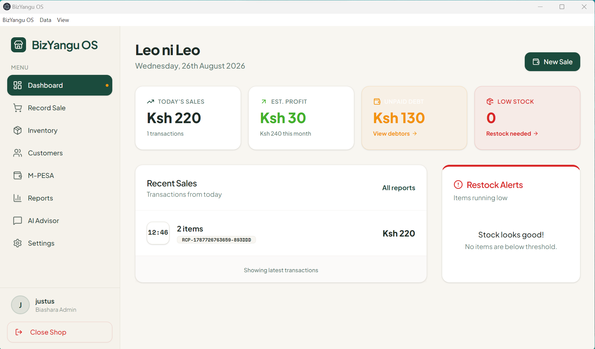
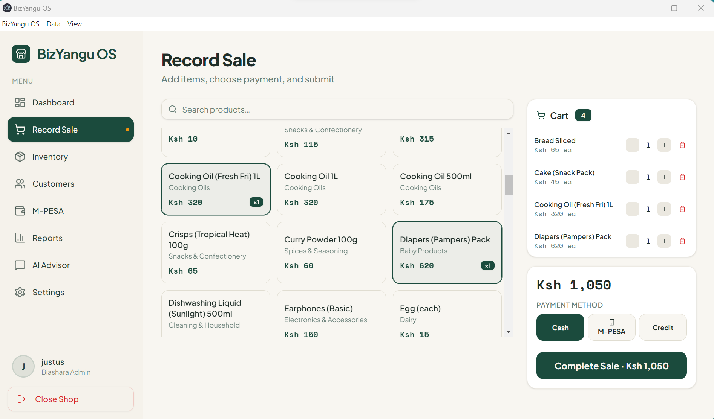
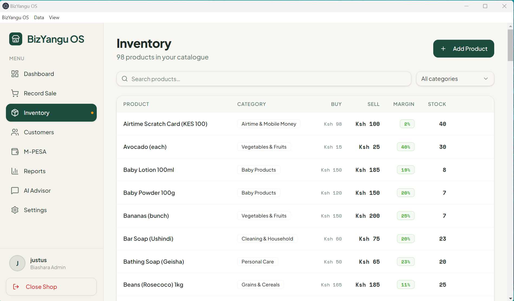

# BizYangu OS

**An offline-first point-of-sale and business management desktop app for Kenyan dukas (small retail shops), with M-PESA integration and an AI business advisor.**

Built for shop owners who need real POS software but can't rely on constant internet access, expensive cloud subscriptions, or a separate database server to install and maintain.

📥 **[Download the latest Windows installer](https://github.com/justus-ndwigah/BizYangu-OS/releases/latest)**

> **Note:** the installer isn't code-signed with a paid certificate, so Windows SmartScreen may show a "Windows protected your PC" warning on first run. Click **"More info" → "Run anyway"** to proceed — this is expected for an unsigned indie build, not a sign of a problem with the app.

---

## Why this exists

Most POS software assumes reliable internet and a monthly subscription. That's a poor fit for many small retail shops, where connectivity is inconsistent and margins are thin. BizYangu OS runs entirely on a single Windows/Mac/Linux desktop, with **zero external services required** to function day-to-day — inventory, sales, customers, and debt tracking all work fully offline. M-PESA payments and an AI advisor are available as optional, connected features layered on top.

## Highlights

- **Embedded database, zero setup** — bundles its own Postgres instance inside the Electron app itself. No separate database server to install, configure, or maintain; the app manages its own local Postgres cluster automatically on first launch.
- **Offline-first architecture** — the entire POS (sales, inventory, customers, debts, reporting) works with no internet connection at all.
- **Real M-PESA STK Push integration** — via Safaricom's Daraja API, with proper async callback handling (not client-side polling).
- **AI business advisor** — natural-language Q&A over the shop's own live data (stock levels, sales trends, debts), powered by Claude.
- **Type-safe, contract-first API** — a single OpenAPI spec generates both the Zod validation schemas (backend) and typed React Query hooks (frontend), so the client and server can't silently drift apart.
- **Role-based multi-user support** — admin and cashier accounts, with optional shared-database mode so multiple till desktops on one shop network can operate against the same live inventory.

## Tech stack

| Layer | Technology |
|---|---|
| Desktop shell | Electron |
| Frontend | React, TypeScript, Tailwind CSS, Radix UI (shadcn-style components), React Query |
| Backend | Node.js, Express, Drizzle ORM |
| Database | PostgreSQL (embedded via `embedded-postgres`, no external install needed) |
| Validation | Zod, generated from OpenAPI spec via Orval |
| Payments | Safaricom Daraja API (M-PESA STK Push) |
| AI | Claude API |
| Packaging | electron-builder (Windows NSIS installer) |
| Monorepo | npm workspaces |

## Architecture

```
┌─────────────────────────────────────────────┐
│                 Electron App                 │
│  ┌─────────────┐        ┌─────────────────┐  │
│  │   Main       │──────▶│  Express API     │  │
│  │   Process    │ spawn │  (child process) │  │
│  └──────┬───────┘       └────────┬─────────┘  │
│         │                        │            │
│         ▼                        ▼            │
│  ┌─────────────┐        ┌─────────────────┐  │
│  │  BrowserWindow│       │ Embedded Postgres│  │
│  │  (React app)  │       │  (own process)   │  │
│  └───────────────┘       └─────────────────┘  │
└─────────────────────────────────────────────┘
```

On first launch, the Electron main process initializes a private Postgres cluster inside the app's data directory, runs database migrations, and starts the bundled API server as a child process. The renderer (React frontend) talks to that local API over HTTP — the same architecture whether running in development or as a packaged installer.

### Monorepo layout

```
apps/desktop/          Electron main process, packaging config
artifacts/biashara-os/ React frontend
artifacts/api-server/  Express API server
lib/db/                Drizzle schema + migrations
lib/api-spec/          OpenAPI spec (source of truth for the API contract)
lib/api-zod/           Generated Zod schemas (from the OpenAPI spec)
lib/api-client-react/  Generated React Query hooks (from the OpenAPI spec)
lib/auth-web/          Shared auth context/hooks
```

## Features

- **Sales** — record sales with cash, M-PESA, or debt payment methods; automatic stock deduction
- **Inventory** — product catalog with categories, buying/selling prices, low-stock thresholds
- **Customers & debts** — track customer balances and outstanding debts
- **M-PESA** — trigger STK Push payments, view transaction history, async callback-driven status updates
- **Reports** — daily sales reports, top-selling products, category breakdowns
- **AI Advisor** — chat interface for natural-language questions about the shop's own data
- **Multi-user** — admin/cashier roles, with the option to share one database across multiple till desktops on a local network
- **Backup & restore** — full data export/import
- **Automatic migrations** — schema changes apply automatically on app startup

## Running it locally

```bash
git clone https://github.com/justus-ndwigah/BizYangu-OS.git
cd BizYangu-OS
npm install
npm run desktop:dev
```

This starts the app in development mode (embedded Postgres + API server + Electron window, all local).

To build a distributable Windows installer:
```bash
npm run desktop:dist
```

See `.env.example` for optional environment variables (M-PESA credentials, AI API key) — the app runs fully functional without any of them, with M-PESA and AI features simply inactive until configured.

## Screenshots
**DASHBOARD**

**SALES**

**Inventory**


## License

MIT
